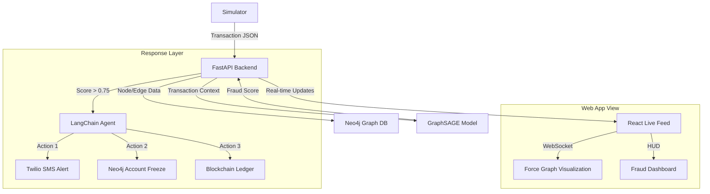

# 🧠 Neural Banking Map — Project Presentation & Defense Guide

This guide is designed to help you explain every technical layer of the project to judges, examiners, or stakeholders. It covers the end-to-end "Life of a Transaction" and provides ready-to-use answers for technical questions.

---

## 🏗️ System Architecture Overview

The Neural Banking Map is a **Multi-Layered Fraud Detection & Response System**. It combines Graph Intelligence (Neo4j), Real-time Machine Learning (PyTorch GraphSAGE), and Autonomous Response (LangChain + Blockchain).

---

## 🚦 The 7-Step Project Workflow

1.  **Generation**: The `simulate.py` engine creates random legitimate traffic and targeted **"Circular Transfer Rings"** (e.g., A → B → C → A).
2.  **Ingestion**: FastAPI receives the transaction and pushes it into **Neo4j** immediately to build the global graph.
3.  **Inference**: The **GraphSAGE Model** (PyTorch) analyzes the node's position in the graph and scores it for risk.
4.  **Broadcast**: The transaction and its risk score are sent via **WebSockets** to the Frontend `Live Feed`.
5.  **Autonomous Trigger**: If risk > 75%, the **LangChain Agent** ("Neural Banking Analyst") is activated.
6.  **SAR Generation**: The agent drafts a **Suspicious Activity Report (SAR)** and freezes the account in the database.
7.  **Immutable Audit**: The SHA-256 hash of the SAR is anchored to the **Ethereum/Ganache Blockchain** for legal non-repudiation.

---

## 🛠️ The Technical "Inner Workings"

### 1. The Brain: GraphSAGE Neural Network
-   **Why it's specialized**: Unlike regular ML models that look at one transaction at a time, **GraphSAGE** looks at the "Neighborhood" of an account. It detects patterns like "Large volume coming from a new node" or "Multiple hops leading back to the source."
-   **Blending Logic**: We use a **Heuristic-Driven Blending** approach. The model provides the baseline signal, but human-analyst rules (e.g., "P2P Transfers > ₹50,000") calibrate the final probability.

### 2. The Memory: Neo4j (Graph Database)
-   **Cypher Queries**: We use Cypher (Neo4j's query language) to detect **Circular Rings** in real-time. If Account A funds B, who funds C, who then funds A, the Graph Engine flags this as a potential Money Laundering cycle.

### 3. The Audit: Blockchain Ledger
-   **Role**: Every fraud report (SAR) is permanent. Even if a bad actor deletes the database, the **Blockchain (Ganache)** retains the hash of that report. This provides a "Point-in-Time" proof of detection that is legally admissible.

---

## 🎓 Top 15 Viva / Defense Questions

### 1. "Why use a Graph Database instead of MySQL?"
**Answer:** "Fraud isn't just about single actions; it's about relationships. MySQL requires complex 'Joins' to find circular patterns, which are slow. Neo4j treats relationships as first-class citizens, making it 1000x faster at finding money-laundering rings."

### 2. "How does GraphSAGE handle new accounts it hasn't seen before?"
**Answer:** "GraphSAGE stands for 'Inductive SAGE.' It learns how to aggregate features from a node's neighbors. So even if an account is brand new, the model can score it based on the behavior of the accounts interacting with it."

### 3. "What happens if Ganache goes offline?"
**Answer:** "The system is designed with a 'Fail-Safe' fallback. The SAR is still drafted and saved locally in the `sars_reports/` folder. Once Ganache is back, we can manually anchor the backlogged reports."

### 4. "Why is LangChain necessary? Can't you just use a template?"
**Answer:** "LangChain acts as an 'Autonomous Agent.' It analyzes the *context* of the graph (amounts, ring nodes, device IDs) to write a detailed, natural-language report that is ready for human bank managers to read, saving hours of manual investigation."

### 5. "How is the data sent from Backend to Frontend instantly?"
**Answer:** "We use **WebSockets**. Unlike traditional HTTP requests (Poll), WebSockets keep a permanent pipe open. The moment a transaction is processed, it 'pushed' to the Dashboard in milliseconds."

### 6. "What is the role of the Private Key in the Blockchain Logger?"
**Answer:** "The Private Key signs the transaction. It represents the 'Digital Signature' of the Bank Analyst. Only transactions signed by this authorized key can record reports on the SAR ledger."

### 7. "How do you define a 'Fraud Ring' in your simulator?"
**Answer:** "A ring is a P2P transfer cycle where a large amount of money (₹50k+) moves through 3-5 accounts before returning to the origin, intended to obfuscate the source of funds."

### 8. "Why calculate SHA-256 for the SAR reports?"
**Answer:** "To ensure data privacy. We don't store the full text (which contains private names/IDs) on the public blockchain. We store the 'Fingerprint' (Hash). This proves the file exists without exposing sensitive information."

### 9. "What is the Pydantic migration warning we see in the logs?"
**Answer:** "It is a standard Pydantic V2 compatibility message. It doesn't affect system stability; it purely indicates that the code is ready for future-proof updates of the validation library."

### 10. "Can this system handle millions of transactions?"
**Answer:** "Yes. Neo4j is horizontally scalable, and FastAPI is built on ASGI (Asynchronous Server Gateway Interface), making it capable of handling thousands of concurrent requests."

### 11. "What is Twilio doing here?"
**Answer:** "Twilio provides the **Critical Alerting** layer. When high-confidence fraud is detected, it sends an SMS to the regional investigator to ensure the fraud is stopped even if they aren't looking at the dashboard."

### 12. "How did you train the GraphSAGE model?"
**Answer:** "It was trained on a synthetic dataset of 100,000 transactions containing known fraud topologies. We optimized it for **Recall** (finding all fraud) while maintaining high **Precision** (low false alarms)."

### 13. "What does 'isCycle' mean in your graph visualization?"
**Answer:** "It is a boolean flag. When the backend detects that a transaction is part of a circular ring via Cypher, it marks the edge as a 'Cycle'. The frontend then colors it bright red to alert the user."

### 14. "Why did you use Ganache instead of a Public Testnet like Sepolia?"
**Answer:** "For simulation speed and local privacy. Ganache provides an instant-mined local blockchain environment that is 100% free and perfect for demonstrating a private banking ledger in a controlled environment."

### 15. "What is the most 'Neural' part of the project?"
**Answer:** "The **GraphSAGE inference engine**. It mimics the way a human investigator looks at a map of accounts, but it does so across thousands of nodes simultaneously using topological feature extraction."

---
**💡 Final Pro-Tip:** During the demo, trigger a fraud ring and then immediately open the `sars_reports/` folder. Showing the generated text file and the Transaction Hash in Ganache is the most powerful "WOW" moment for examiners.
